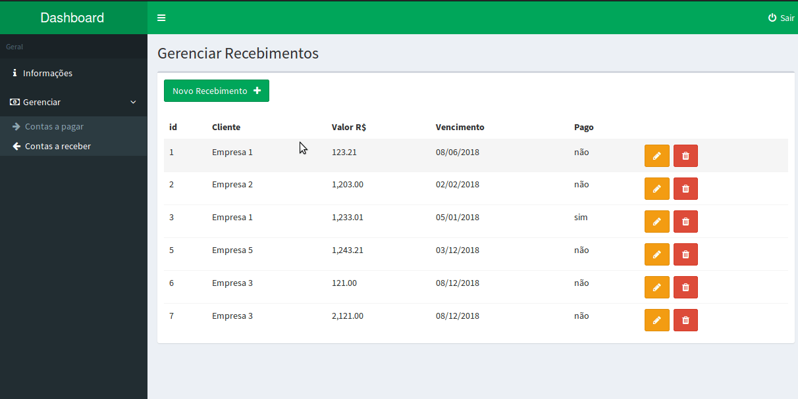

# Dashboard Laravel 5.5 + adminLTE
Projeto simples para servir de base para estudo das funcionalidades do laravel 5.5 

#### Assuntos estudados
- instalação com composer
- Migrations
- seeders
- autenticação
- Models
- requests para validação
- controllers 
- Rotas
- comandos do artisan (make, serve, tinker.. etc)
- Blade
- AdminLTE
- Gráfico com ChartJS

##### instalação
- verifique os pré-requisitos para a instalação do laravel 5.5 [aqui](https://laravel.com/docs/5.5)
- Clone o repositório
- Use o comando `composer install` para instalar as dependências
- Crie um Banco de dados no mysql
- Modifique o arquivo `.env.example` com as configs do Banco de dados, inclusive o nome do BD criado e mude o nome do arquivo para `.env`
- Rode as migrations e os seeders com o comando `php artisan migrate --seed`
- Sirva a aplicação com o comando `php artisan serve`
- Logue com o usuário padrão admin@email.com senha 1234
